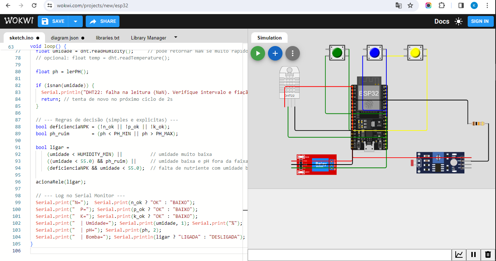
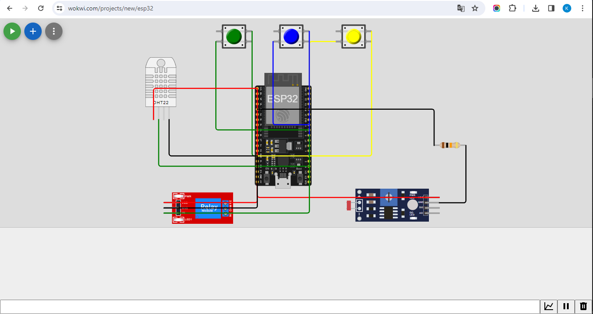

# 🌱 FarmTech Solutions – Fase 2  
## Sistema de Irrigação Inteligente com ESP32 (Wokwi)

### 👩‍💻 Equipe
- **Desenvolvedor:** Klayver Lima  
- **Startup:** FarmTech Solutions (FIAP – Inteligência Artificial)
[GITHUB] (https://github.com/klayverlima05ia/farmtech_fase2)

---

## 🎯 Objetivo
Simular um sistema inteligente de irrigação para monitorar e controlar variáveis agrícolas — **Nitrogênio (N)**, **Fósforo (P)**, **Potássio (K)**, **pH do solo** e **umidade** — usando o **ESP32** e sensores didáticos no **Wokwi**.

A bomba de irrigação é acionada automaticamente conforme as condições simuladas.

---

## ⚙️ Componentes e Ligações

| Componente | Função | Pino ESP32 | Descrição |
|-------------|---------|-------------|------------|
| Botão N | Nitrogênio | GPIO 18 | Pressionado = OK |
| Botão P | Fósforo | GPIO 19 | Pressionado = OK |
| Botão K | Potássio | GPIO 21 | Pressionado = OK |
| LDR | Simula pH do solo | GPIO 34 | Leitura analógica (0–14) |
| Resistor 10kΩ | Divisor de tensão do LDR | GPIO34 ↔ GND | Define nível do pH |
| DHT22 | Sensor de umidade | GPIO 15 | Mede umidade (0–100%) |
| Relé | Bomba d’água | GPIO 5 | Liga/Desliga irrigação |

---

## 🔌 Esquema do Circuito
*(Imagem gerada no Wokwi mostrando o circuito completo — anexada abaixo)*  

---

## 🧠 Lógica de Funcionamento

1. **Leitura dos sensores:**
   - LDR → converte intensidade de luz em pH.
   - DHT22 → fornece a umidade atual.
   - Botões → simulam presença ou deficiência de N, P e K.

2. **Decisão da irrigação:**
   - Se a **umidade < 40%**, a bomba **liga**.
   - Se o **pH** estiver muito ácido ou alcalino (fora de 6–7,5), a bomba **liga** para compensar.
   - Caso o NPK esteja **deficiente**, também pode acionar irrigação.
   - Se o solo estiver úmido e os nutrientes normais, a bomba **desliga**.

3. **Saída no Serial Monitor:**
   Exemplo:
N=OK P=BAIXO K=OK | Umidade=35.0% | pH=6.7 | Bomba=LIGADA

---

## 🧰 Ferramentas Utilizadas
- **Plataforma:** Wokwi.com  
- **Microcontrolador:** ESP32  
- **Sensor:** DHT22 (umidade)  
- **Simuladores:** LDR (pH), Botões (NPK), Relé (bomba)  
- **IDE:** VS Code + Arduino  
- **Linguagem:** C/C++

---

## 📹 Demonstração
📺 Link do vídeo (YouTube, modo “não listado”):  
[Assista aqui](https://youtu.be/B133e_VY0kc)

---

## 📎 Estrutura do Projeto
FarmTech_Fase2/
├─ sketch.ino
├─ README.md
├─ imagem_circuito.png
└─ video_link.txt

---

